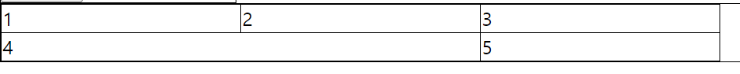

# 0218

### 요즘 하는 CSS 기본 양식

- body에 margin값이 있어서 margin을 0으로 세팅해준다.

```css
body{
    margin: 0;
}
```

- div의 box-sizing을 border-box로 세팅해준다(padding이 들어있어 내용물이 튀어나올 수 있다).

```css
div, textarea{
    box-sizing: border-box;
}
```

### input & label

- form안에 들어있어야 한다.
- type에는 `text`, `password`, `email`, `number`, `date` 등이 있다.
- `type=”checkbox”` : 체크 박스를 넣는다.
- `type=”radio”` : 선택지 중에 선택할 수 있게 해준다.
    - `name`이라는 태그를 추가로 줘서 같은 name인 얘들 중에 선택할 수 있게 해준다.
    - `label`이라는 태그를 줘서 무엇을 선택할지 정해준다.
    - input `id`와 label `for`을 연결을 해줘야 글자를 선택했을 때 선택이 가능하다.
    
    ```html
    <input type="radio" name="bundle" id="content1">
    <label for="content1">첫번쨰</label>
    <input type="radio" name="bundle" id="content2">
    <label for="content2">두번째</label>
    ```
    
- `type=”submit”` : input에 적은 내용을 백엔드에 제출한다.
- `placeholder` : 입력 필드에 사용자가 적절한 값을 입력할 수 있도록 도와주는 짧은 도움말
- `value` : default값을 정해준다.
- 타입별로 CSS를 줄 수 있다

```css
.input-class input[type=radio]{
    width: 100%;
}
```

### table(표)

- `table/tr/td`
    - `tr` : 행
    - `td` : 열

```html
<div class="component-class">
	<table clss="my-table">
	  <tr>
		  <td>1</td>
	    <td>2</td>
	    <td>3</td>
	  </tr>
	  <tr>
	    <td>4</td>
	    <td>5</td>
	    <td>6</td>
		</tr>
	</table>
</div>
```

```css
.my-table{
    border-collapse: collapse;
}

.my-table tr td{
    border: 1px solid black;
}
```

- `border-collapse: collapse;` : td 사이에 여백을 없애준다.
- `colspan` : 컬럼 칸수

```html
	<table clss="my-table">
	  <tr>
		  <td>1</td>
	    <td>2</td>
	    <td>3</td>
	  </tr>
	  <tr>
	    <td colspan="2">4</td>
	    <td>5</td>
		</tr>
	</table>
```



### !important

- CSS에서 다 무시하고 제일 우선순위로 만들 수 있다

```css
.component-signup input[type=submit]{
    width: 200px !important;
}
```