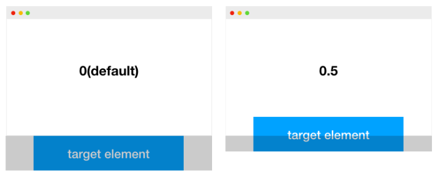

# JS

### **Intersection Observer API**

addEventListener의 scroll이벤트의 단점(단시간에 수백, 수천번 호출될 수 있고, 동기적으로 실행되기 떄문에 메인스레드에 영향을 줄 수 있다 )들을 보완하기 위해 나타난 가시성 관련 API

```jsx
const io = new IntersectionObserver(callback[, options])
```

- `callback`
    - 타겟 엘리먼트가 교차되었을 때 실행할 함수
    - `entries` :  [IntersectionObserverEntry](https://developer.mozilla.org/en-US/docs/Web/API/IntersectionObserverEntry) 객체의 리스트. 배열 형식으로 반환하기 때문에 forEach를 사용해서 처리를 하거나, 단일 타겟의 경우 배열인 점을 고려해서 코드를 작성해야 한다.
    - `observer`: 콜백함수가 호출되는 IntersectionObserver
- `rootMargin`
    - default: `'0px 0px 0px 0px'`
    - root 엘리먼트의 마진값.
    - css에서 margin을 사용하는 방법으로 선언할 수 있고, 축약도 가능하다.
    - rootMargin 값에 따라 교차 영역이 확장 또는 축소된다.
- `threshold`
    - default: `0`
    - 0.0부터 1.0 사이의 숫자 혹은 이 숫자들로 이루어진 배열
    - 타겟 엘리먼트에 대한 교차 영역 비율을 의미한다.
    - 0.0의 경우 타겟 엘리먼트가 교차영역에 진입했을 시점에 observer를 실행하는 것을 의미하고, 1.0의 경우 타켓 엘리먼트 전체가 교차영역에 들어왔을 때 observer를 실행하는 것을 의미합니다.
    
    
    
- **`[IntersectionObserver.observe(targetElement)](https://developer.mozilla.org/en-US/docs/Web/API/IntersectionObserver/observe)`**
    - 타겟 엘리먼트에 대한 IntersectionObserver를 등록할 때(관찰을 시작할 때) 사용한다.
- **`[IntersectionObserver.unobserve(targetElement)](https://developer.mozilla.org/en-US/docs/Web/API/IntersectionObserver/unobserve)`**
    - 타겟 엘리먼트에 대한 관찰을 멈추고 싶을 때 사용하면 된다.
- **`[IntersectionObserver.disconnect()](https://developer.mozilla.org/en-US/docs/Web/API/IntersectionObserver/disconnect)`**
    - 다수의 엘리먼트를 관찰하고 있을 때, 이에 대한 모든 관찰을 멈추고 싶을 때 사용하면 됩다.
- **`[IntersectionObserver.takerecords()](https://developer.mozilla.org/en-US/docs/Web/API/IntersectionObserver/takeRecords)`**
    - `IntersectionObserverEntry` 객체의 배열을 리턴한다.