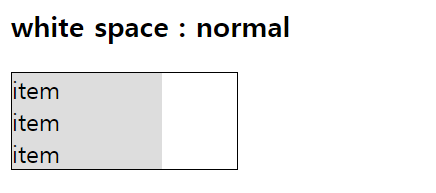

# 0216

### white-space

- 여백 처리 방법
- `white-space : normal` : 컨테이너가 아이템을 감싼다.(wrap)



- `white-space : nowrap` : 컨테이너가 아이템을 감싸지 않는다.


### position

- 아이템을 위치시키는 방법
1. static
    - 움직이지 않는다.
    - 대부분 엘리먼트의 기본 값
2. relative
    - 엘리먼트가 자신의 원래 위치를 기준으로 위치한다.
3. aboslute
    - 엘리먼트가 relative 부모를 기준으로 위치한다.
    
    ```html
    <div class="container relative">
      <div class="item absolute top-0 left-0">item1</div>
      <div class="item absolute top-0 right-0">item2</div>
      <div class="item absolute bottom-o left-0">item3</div>
    	<div class="item absolute bottom-o right-0">item4</div>
    </div>
    ```
    
    ```css
    .container{
      border: 1px solid;
      width: 200px;
      height: 200px;
    }
    
    .item{
      background-color: #ddd;
      padding: 0.5rem;
    }
    
    .relative{
      position: relative;
    }
    .absolute{
      position: absolute;
    }
    .top-0{
      top:0;
    }
    .left-0{
      left: 0;
    }
    .bottom-o{
      bottom: 0;
    }
    .right-0{
    	right: 0;
    }
    ```
    
    
    
4. fixed
- 엘리먼트가 뷰포트를 기준으로 위치

```html
<div class="item fixed top-0 left-0">item1</div>
<div class="item fixed top-0 right-0">item2</div>
<div class="item fixed bottom-o left-0">item3</div>
<div class="item fixed bottom-o right-0">item4</div>
```

```css
.item{
    background-color: #ddd;
    padding: 0.5rem;
}
.fixed{
	  position: fixed;
}
.top-0{
    top:0;
}
.left-0{
    left: 0;
}
.bottom-o{
    bottom: 0;
}
.right-0{
		right: 0;
}
```


### transform

1. `translate(left,top)` : 엘리먼트가 자신의 원래 위치를 기준으로 움직인다. 
2. `scale(조정값)` : 엘리먼트의 크기를 조정한다. 
3. `rotate(각도)` : 엘리먼트를 회전시킨다.

## image

### object fit

1. `object-fit : fill`
    - default값
    - 이미지가 주어진 공간을 채운다.
    - 이미지의 비율이 주어진 비율로 바뀐다.
    - 이미지가 늘어나거나 줄어들 수 있다.
    
    
    
2. `object-fit : contain`
    - 이미지가 원본 비율을 유지한다.
    - 남는 공간이 생길 수 있다.
    
    
    
3. `object-fit : cover`
    - 이미지가 주어진 공간을 채운다.
    - 이미지가 원본 비율을 유지한다.
    - 이미지가 잘릴 수 있다.
    
    