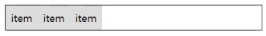

# 0219(flex)

### flex

- flex 컨테이너와 flex 아이템을 활용하여 다양한 레이아웃을 만들 수 있다.
- 컨테이너 속성
    - flex direction (아이템의 배열 방향)
        - `flex-direction : row` (default)
        
        
        
        - `flex-direction : col`
        
        
        
    - flex wrap
        - 아이템을 감쌀 것인지 결정
        
        ```css
        .container{
        	width: 150px;
          border: 1px solid;
        }
        
        .item{
          background-color: #ddd;
          width: 100px;
          padding: 0.5rem;
        }
        ```
        
        - `flex-wrap : nowrap` (default)
            - 아이템의 크기가 줄어든다
            
            
            
        - `flex-wrap: wrap`
            - 컨테이너의 넓이가 부족할 때 아이템을 아래로 떨어뜨린다
            
            
            
    - justify content (row)
        - `flex-direction : row`
        - 아이템의 배열 방법
        - `justify-content : flex-start` (default)
            
            
            
        - `justify-content : center`
            
            
            
        - `justify-content : space-between`
            
            
            
        - `justify-content : flex-end`
            
            
            
    - justify content (col)
        - `flex-direction : column`
        - 아이템의 배열 방법
        - `justify-content : flex-start` (default)
            
            
            
        - `justify-content : center`
            
            
            
        - `justify-content : space-between`
            
            
            
        - `justify-content : flex-end`
            
            
            
    - align items (row)
        - `flex-direction : row`
        - 행의 위치
        - `align-item : stretch (default)`
            - 아이템이 늘어난다
            
            
            
        - `align-item : flex-start`
            
            
            
        - `align-item : center`
            
            
            
        - `align-item : flex-end`
            
            
            
    - align items (col)
        - `flex-direction : col`
        - 열의 위치
        - `align-item : stretch`
            
            
            
        - `align-item : flex-start`
            
            
            
        - `align-item : center`
            
            
            
        - `align-item : flex-end`
            
            
            
- 아이템 속성
    - flex basis
        - 아이템의 크기
            - `flex-directiion : row` 일때 넓이
            - `flex-directiion : column` 일때 높이
        - `flex-basis : 00`
    - flex grow
        - 아이템의 크기를 증가시킨다.
        - `flex-grow : 0` (default)
        - flex-grow : 1 (가득찰떄까지)
    - flex shrink
        - 아이템의 크기를 감소시킨다.
        - `flex-shrink : 1` (default)
        - `flex-shrink : 0`
    - flex order
        - 아이템의 배열 순서
        
        ```css
        .order-none{
          order:0;
        }
        .order-1{
          order: 1;
        }
        .oreder-2{
          order: 2;
        }
        .order-3{
        	order: 3;
        }
        ```
        
        ```html
        <div class=" item order-2">item1</div>
        <div class=" item order-3">item2</div>
        <div class=" item order-none">item3</div>
        <div class=" item order-1">item4</div>
        ```
        
        